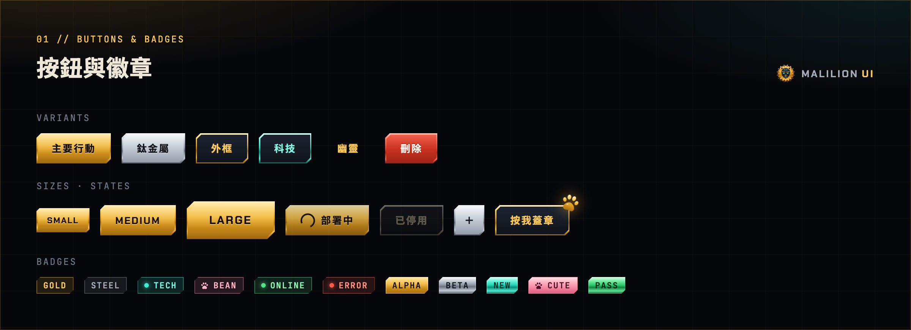
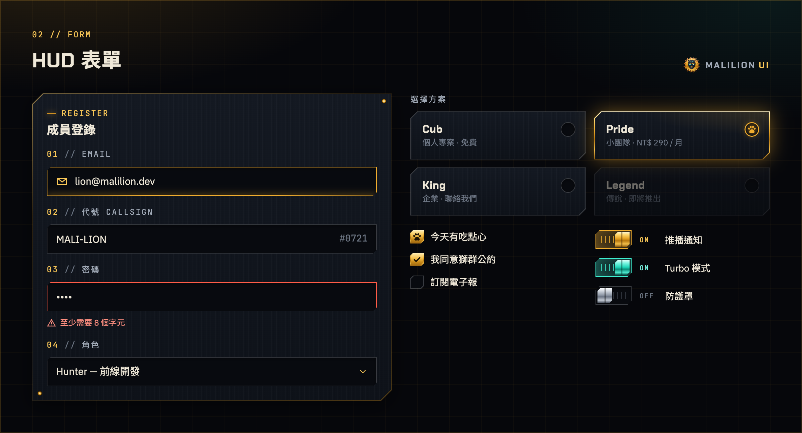
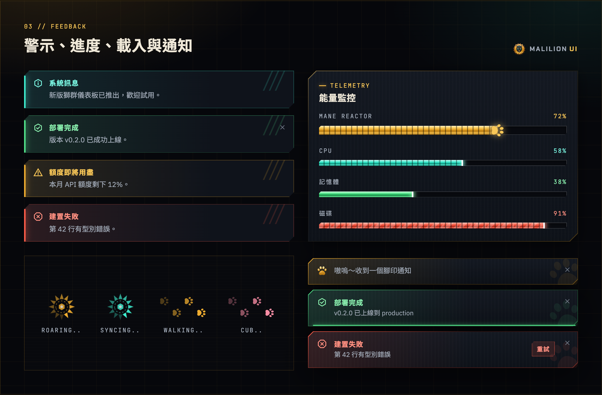
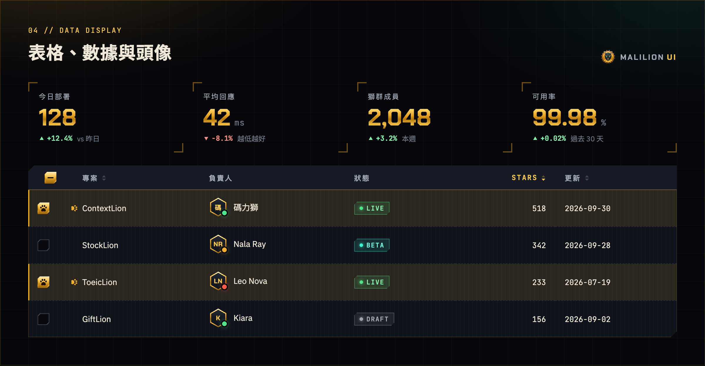
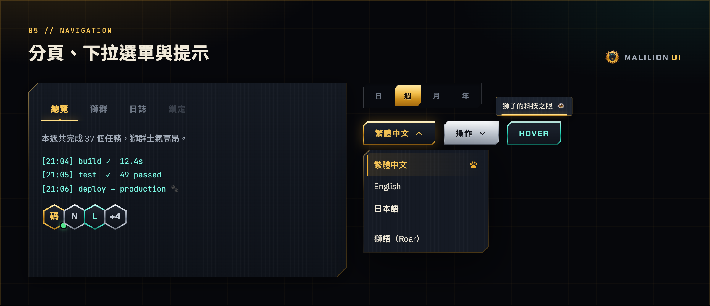
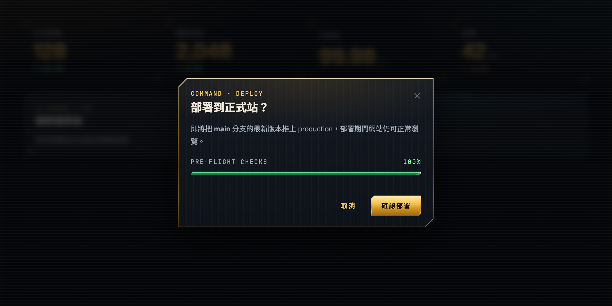
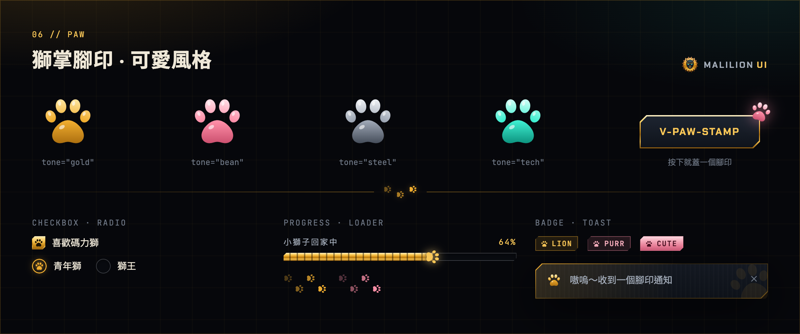
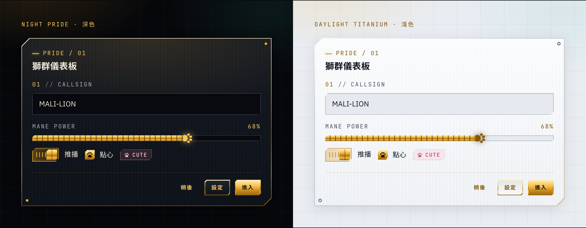
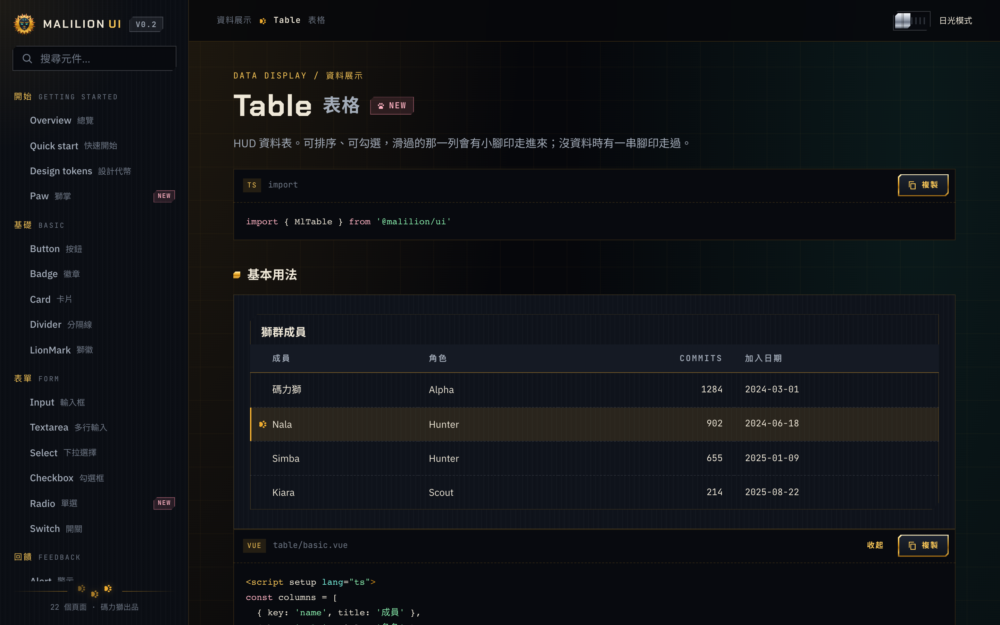

<p align="center">
  
</p>

<p align="center">
  <b>English</b> · <a href="README.zh-TW.md">繁體中文</a>
</p>

<p align="center">
  <a href="https://malilion.github.io/MalilionUI/"><b>📖 Docs &amp; live demos</b></a> ·
  <a href="#install">Install</a> ·
  <a href="#gallery">Gallery</a> ·
  <a href="#components">Components</a>
</p>

<p align="center">
  <a href="https://github.com/malilion/MalilionUI/actions/workflows/docs.yml"></a>
  
  
  
</p>

# MalilionUI

> A lion for a soul, tech for bones, metal for armour — and a trail of cute toe-bean paw prints.

MalilionUI is the component library of **Malilion (碼力獅)**, the "code lion". Chamfered armour plates,
polished lion gold, titanium and circuit-cyan glow, plus paw prints tucked into the components
(checkboxes, radios, toasts, tables, loaders… and buttons that leave a stamp).
It ships with a dark **Night Pride** theme by default and a light **Daylight Titanium** theme.

- 26 components for Vue 3.5+, written in TypeScript with full types
- [Docs site](https://malilion.github.io/MalilionUI/): sidebar menu, one page per component, every example's source one click away
- Framework-agnostic styling: everything visual lives in `.ml-*` classes and `--ml-*` CSS variables, so React, Next or plain HTML can use it too
- Zero runtime dependencies (Vue is a peer dependency)
- Accessible: keyboard support, focus trapping, ARIA wiring, and `prefers-reduced-motion`

## Gallery

### Buttons & badges

Machined metal plates with a polished sheen that sweeps across on hover. Add `stamp` and every press leaves a paw print.



### HUD forms

Focus turns the rim gold and fires an energy line along the bottom. Picking a radio presses a gold paw into it; radios can also be selectable cards.



### Alerts, progress, loaders & toasts

Alerts carry three claw marks in the corner, progress bars can have a paw running along the tip, and toasts are stamped with a faint paw watermark.



### Tables, stats & avatars

A sortable, selectable HUD data table where a little paw walks onto the hovered row, plus hexagonal badge avatars.



### Tabs, dropdowns & tooltips



### Modal

A command console that opens out from its centre line over a scanline, blurred backdrop.



### Paw prints · the cute side

`MlPaw` comes in gold, toe-bean pink, titanium and tech cyan, and shows up inside checkboxes, radios, progress bars, loaders, badges and toasts.



### Two themes

The same components in dark Night Pride and light Daylight Titanium.



### Docs site

Sidebar menu, live examples, copy-to-clipboard source and full API tables: <https://malilion.github.io/MalilionUI/>



## Install

> Not published to the npm registry yet.

```bash
npm i @malilion/ui
```

```ts
// main.ts
import { createApp } from 'vue'
import MalilionUI from '@malilion/ui'
import '@malilion/ui/style.css'
import App from './App.vue'

createApp(App).use(MalilionUI).mount('#app')
```

For toasts, put one `<MlToastHost />` in `App.vue`, then call `toast()` from anywhere:

```ts
import { useToast } from '@malilion/ui'

const toast = useToast()
toast('Roar!')                         // paw toast by default
toast.success({ title: 'Deployed', message: 'v0.2 is live' })
```

Or import only what you need:

```ts
import { MlButton, MlCard } from '@malilion/ui'
```

### Fonts (recommended)

The components use these fonts and fall back to system fonts without them. Add to `index.html`:

```html
<link
  href="https://fonts.googleapis.com/css2?family=Chakra+Petch:wght@500;600;700&family=IBM+Plex+Sans:wght@400;500;600&family=JetBrains+Mono:wght@400;600&family=Noto+Sans+TC:wght@400;500;700&display=swap"
  rel="stylesheet"
/>
```

## Themes

Dark is the default. Set `data-ml-theme` on any ancestor (usually `<html>`) to switch, or on a single section to theme just that part:

```html
<html data-ml-theme="light">
```

Add the `ml-app` class to `<body>` for the full-page backdrop (lion-gold glow and grid), text colour and fonts. It's opt-in: the library never styles bare elements.

## Components

| Component | Notes |
| --- | --- |
| `MlButton` | `primary` / `steel` / `outline` / `tech` / `ghost` / `danger`, `sm` / `md` / `lg`, `loading`, `square`, `href`, `stamp` |
| `MlCard` | `plate` / `gold` / `steel` / `tech` shells, `rivets`, `interactive` lift and glow; `#header`, `#actions`, `#footer` slots |
| `MlBadge` | `gold` / `steel` / `tech` / `bean` / `success` / `danger`, `solid`, `dot`, `pulse`, `paw` |
| `MlInput` / `MlTextarea` / `MlSelect` | HUD fields with `label`, `index`, `hint`, `error`, `#prefix` / `#suffix` |
| `MlField` | Label / hint / error frame for your own controls |
| `MlSwitch` | `v-model`, `tone="tech"`, `show-state` for an ON/OFF readout |
| `MlCheckbox` | `v-model`, `hint`, `paw` instead of a check mark, `indeterminate` |
| `MlRadioGroup` / `MlRadio` | Selection presses in a gold paw; `variant="card"` tiles; `options` or child radios |
| `MlProgress` | Energy gauge; omit `value` for indeterminate; `striped`, `smooth`, `paw` runner, four tones |
| `MlTabs` | `line` gold ink or `plate` sliding metal; panel content in `#<value>` named slots |
| `MlModal` | `v-model:open`, Esc / backdrop to close, focus trap, shared scroll lock for nested dialogs |
| `toast()` / `MlToastHost` | Five tones, action button, persistent toasts, countdown pauses on hover |
| `MlTooltip` | `top` / `bottom` / `left` / `right`, wires `aria-describedby` for you |
| `MlAvatar` | Hexagonal medallion, `ring`, `status`, falls back to initials; stack with `.ml-avatar-group` |
| `MlAlert` | `info` / `success` / `warning` / `danger` with claw marks, `closable` |
| `MlLoader` | `reactor` (spinning mane) or `paws` (a cub walking across) |
| `MlStat` | HUD readout; `delta` colours itself by sign |
| `MlTable` | Sorting, selection (`v-model:selected`), `#cell-<key>` slots, hover paw, paw-trail empty state, loading overlay |
| `MlDropdown` | Command menu with arrows / Home / End / typeahead / Esc; `selectable` mode marks the choice with a paw |
| `MlDivider` | `label`, `claw` marks or a `paw` trail |
| `MlLionMark` | Faceted metal lion crest, `glow`, `animated` |
| `MlPaw` | Paw print in `gold` / `bean` (toe-bean pink) / `steel` / `tech` / `current` |
| `v-paw-stamp` | Pops a floating paw print where you press; `MlButton` takes a `stamp` prop |
| `MlIcon` | A small set of built-in icons |

Full props, events, slots and copyable examples for every component are on the [docs site](https://malilion.github.io/MalilionUI/).

### Example

```vue
<script setup lang="ts">
import { ref } from 'vue'
const open = ref(false)
const email = ref('')
</script>

<template>
  <MlCard eyebrow="Pride / 01" title="Pride dashboard" rivets>
    <MlInput v-model="email" index="01" label="Email" type="email" />
    <template #footer>
      <MlButton variant="ghost">Cancel</MlButton>
      <MlButton stamp @click="open = true">Deploy</MlButton>
    </template>
  </MlCard>

  <MlModal v-model:open="open" eyebrow="Command" title="Deploy to production?">
    Push the current version live?
    <template #footer="{ close }">
      <MlButton variant="ghost" @click="close">Cancel</MlButton>
      <MlButton @click="close">Deploy</MlButton>
    </template>
  </MlModal>
</template>
```

## Using it from React or plain HTML

Import the CSS and write the classes; the templates in `src/components/*.vue` show the markup:

```tsx
import '@malilion/ui/style.css'

export function DeployButton() {
  return <button className="ml-btn ml-btn--primary ml-btn--md">Deploy</button>
}
```

If you only want the design tokens (colours, metal gradients, fonts, easing), import `@malilion/ui/css/tokens.css`.

## Design language

| Element | How |
| --- | --- |
| **The Malilion cut** | Top-left and bottom-right corners chamfered like a machined plate. The root is never clipped; the rim and face live on `::before` / `::after`, so focus rings and glows survive |
| **Metal** | `--ml-metal-*` gradients: a specular band on top, a dark core, a reflected rim at the bottom |
| **Lion** | Lion-gold palette, mane loader, claw marks, the lion crest |
| **Cute** | Toe-bean paw prints (`MlPaw`), `--ml-bean-*` pink, button stamps, squishy pop animations — an accent that never overrides the metal |
| **Tech** | Circuit cyan for focus and data, HUD labels, scanlines, energy cells |
| **Focus** | A cyan rectangular "target lock" that stays clear in both themes |

## Development

```bash
npm install
npm run dev          # docs site (playground/) at http://127.0.0.1:5287
npm test             # Vitest component tests
npm run typecheck    # vue-tsc
npm run build        # dist/: ESM + style.css + .d.ts
npm run screenshots  # regenerate the README images (needs Google Chrome installed)
```

Every push to `main` runs the type check and tests in GitHub Actions, then deploys the docs site to GitHub Pages.

## Project layout

```
src/
  index.ts              # plugin, named exports, GlobalComponents types
  types.ts              # public types
  composables.ts        # attrs splitting, scroll lock
  toast.ts              # toast queue and toast() API
  pawStamp.ts           # v-paw-stamp directive
  components/           # Ml*.vue
  styles/
    tokens.css          # design tokens (both themes)
    base.css            # .ml-app shell, utilities, keyframes
    components/*.css    # per-component styles
playground/             # docs site
  registry.ts           # menu, pages, examples and API tables
  examples/**/*.vue     # each example is both the live demo and the copyable source
  shots.html            # composition page for README screenshots (not deployed)
scripts/screenshots.mjs # writes docs/images/*.png
tests/                  # component tests
```
